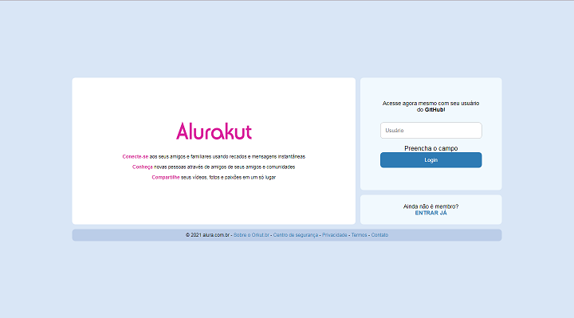
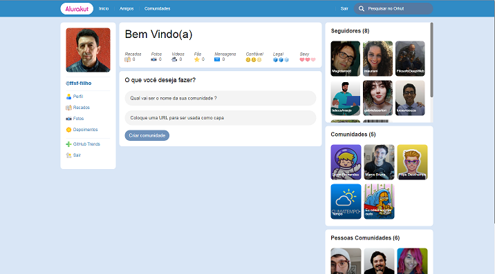

<h1 align="center">
  <a href="https://alurakut-ffsf-filho.vercel.app">Alurakut with NextJS</a>
</h1>
<h2 align="center">Alura.Kut developed in Imersao React v3 sponsored by Alura, was specified to reproduce the old social network of Orkut.</h2>

### Login screen



### Profile Screen



Content
=======

* [About](#About)
* [Technologies](#Technologies)
* [Downloading](#Downloading)
* [Configure](#Configure)
* [StartingTheApplication](#Starting)

<div id="About">

## About

### This project was coded by @ffsf-filho during my participation in the React immersion with Next.Js v3 sponsored by Alura, between July 12th and 16th, 2021.

</div>

<div id="Downloading">

## Downloading

<strong><a href="https://github.com/ffsf-filho/alurakut/archive/main.zip">Download ZIP</a></strong>
<br/>
<strong>OR</strong>

```
git clone  https://github.com/ffsf-filho/alurakut.git
```

</div>
<div id="Technologies">


## Technologies

<code>
  
</code>
<code>
  
</code>
<code>
  
  </code>
<code>
  
  </code>

</div>

<div id="Configure">

## Configure

#### You must configure in the next.config.js file, in the 'env' property the variables "fullToken" and "readToken" with their valid DATO CMS tokens to have your customized page.

```
env: {
fullToken: set a valid token,
readToken: set a valid token,
},
```
</div>

<div id="Starting">


## Starting

```
  npm install
  npm run dev
```

OR

```
  yarn 
  yarn dev
```

</div>

### Features

- [X] Login/Logout
- [X] Perfile
- [X] Endpoint of git API
- [X] Endpoint of DATO CMS

### [](https://github.com/alura-challenges/alurakut-base/blob/master/LICENSE)

### Autor

---

<table>
  <tr>
      <td align="center">
        <a href="https://github.com/ffsf-filho">
          
          <br />
          <sub>
            <b>Francisco F S Filho</b>
          </sub>
        </a>
      </td>
  </tr>
</table>
